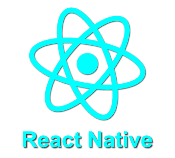
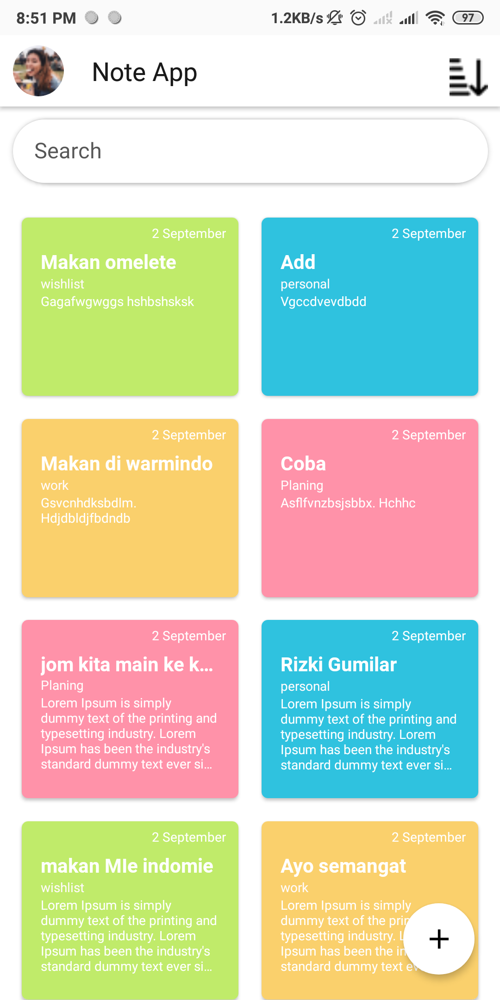
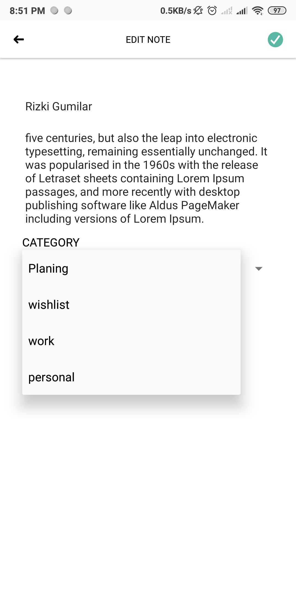
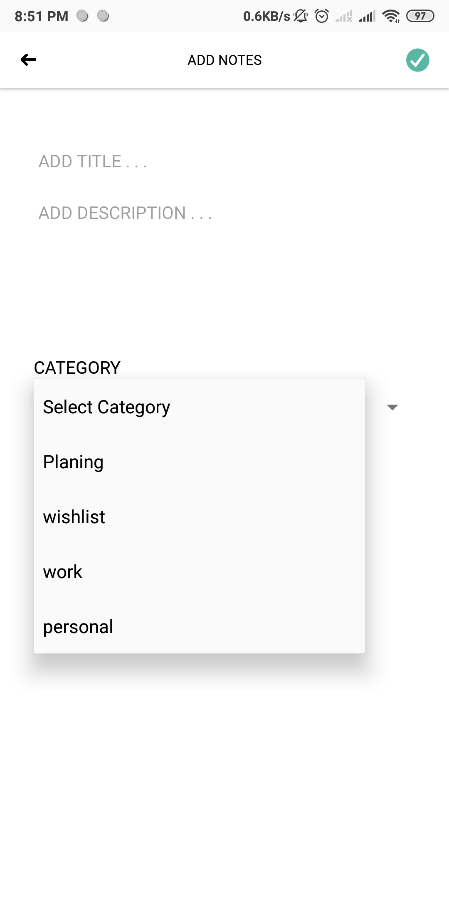
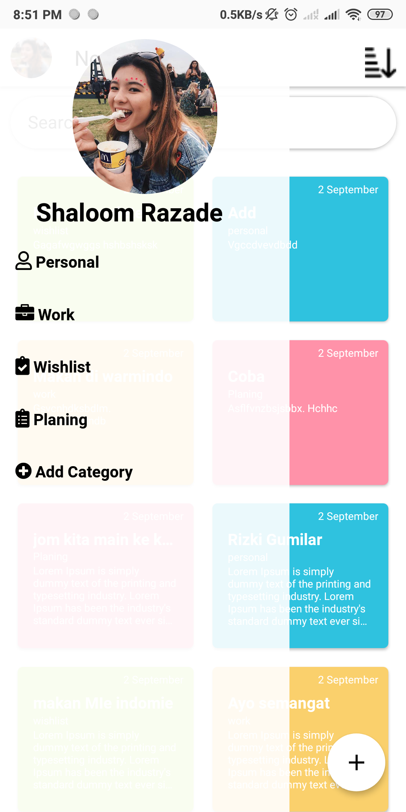

<h1 align="center">Note App</h1>

  

  Built with React Native.

## Table of Contents

- [Introduction](#introduction)
- [Features](#features)
- [Requirements](#requirements)
- [Usage](#usage-for-development)
- [Screenshots](#screenshots)
- [Related Project](#related-project-backend)

## Introduction
This is a simple note apps build with react native and API using express  

## Features
* you can write your personal list , work list or many more
* And others

## Requirements
* [`npm`](https://www.npmjs.com/get-npm)
* [`react-native`](https://facebook.github.io/react-native/docs/getting-started)
* [`react-native-cli`](https://facebook.github.io/react-native/docs/getting-started)
* [`PasarQ RESTful API`](https://github.com/muhammadrisano/Pasar-Qita-Backend-Express.git)

## Usage for development
1. Open your terminal or command prompt
2. Type `git clone https://github.com/rizkigumilar/Frontend-NoteApp.git`
3. Open the folder and type `npm install` for install dependencies
4. Before run this, you must run backend first
5. Type `react-native run-android` for run this app. ***Make sure your device is connected with debugging mode***.

## Screenshots

        
    
    
     

## Related Project (Backend)
* [NoteApps RESTful API](https://github.com/rizkigumilar/Backend-NoteApp.git)

